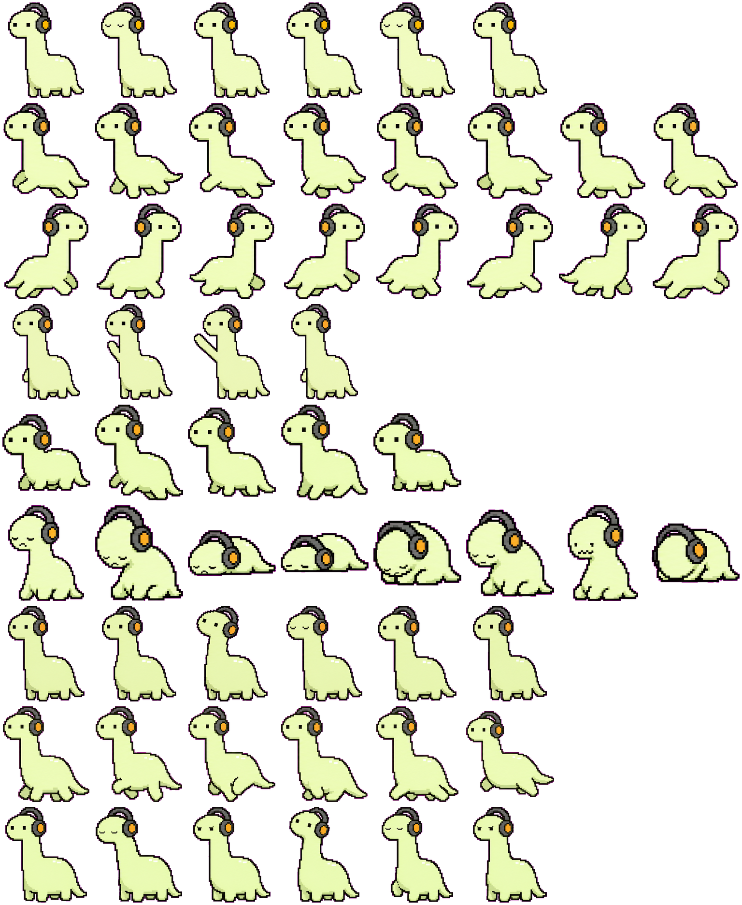

# DenoTune Codex Pet

`DenoTune` is a Codex-compatible animated desktop pet inspired by the Deno mascot.
It keeps the long-neck silhouette, adds headphones, and uses a clean pixel-pet style that fits well in Codex.

| In Ideal | In Prompt |
| --- | --- |
|  |  |

## What It Includes

- Codex-compatible pet package
- Animated states for `idle`, `running`, `running-left`, `running-right`, `waving`, `jumping`, `waiting`, `review`, and `failed`
- Ready-to-install `denotune` pet folder
- Preview screenshots and spritesheet asset

## Install

1. Open the Codex pets settings page:  
   [Codex Pets Settings](https://developers.openai.com/codex/app/settings#codex-pets)
2. Copy the [`denotune`](denotune) folder into your local Codex pets directory.
3. Restart Codex, or reload pets if your Codex build supports live reload.

## Spritesheet

## Credits

- Created with Codex using the `hatch-pet` skill workflow
- Inspired by the Deno open-source JavaScript runtime mascot and reference sketches
- Reference image credit: [hashrock.hatenablog.com](https://hashrock.hatenablog.com/entry/2019/12/29/161310)

## Disclaimer

This is an unofficial fan-made pet. It is not affiliated with or endorsed by the Deno project.
