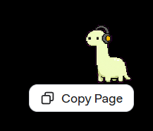
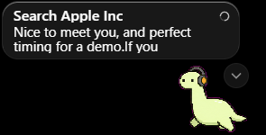
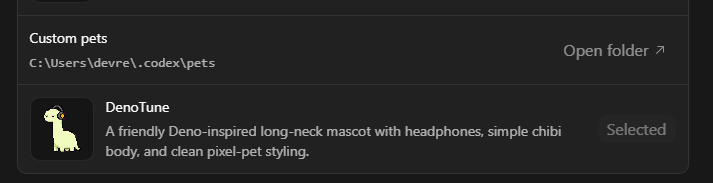

# 🦖 DenoTune Codex Pet

DenoTune is a Codex-compatible animated pet inspired by the Deno JavaScript runtime mascot.   
It is a small long-neck companion with headphones, a pale green body, chunky pixel-style outlines, and animation states for idle, running, waving, jumping, waiting, reviewing, and failure reactions.

## 🚀 Install

1. To install the pet locally, copy the `denotune` folder into your Codex pets directory:  
https://developers.openai.com/codex/app/settings#codex-pets  

2. Then restart Codex or reload pets if your Codex build supports live reload.

## 🎓 Credits

1. This pet is created with official `hatch-pet` skills via Codex.

2. This pet is an unofficial fan-made Codex pet inspired by the Deno open-source JavaScript runtime mascot and reference sketches. It is not affiliated with or endorsed by the Deno project.

3. Thanks to https://hashrock.hatenablog.com/entry/2019/12/29/161310 for the references image.